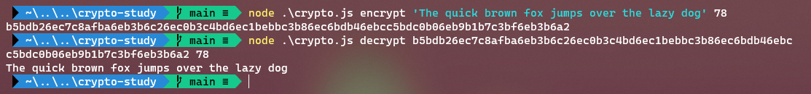
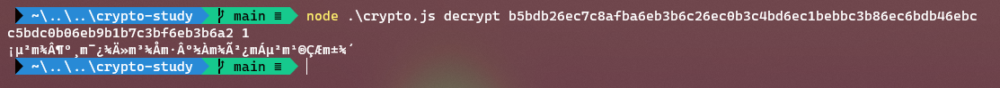

# crypto-study

Estudo de criptografia para a matéria de Gestão de Sistemas Operacionais.

## Introdução

O algoritmo de criptografia foi criado utilizando JavaScript, mais especificamente designado para rodar utilizando `Node.js`. O usuário deve inserir um texto (o _input_) e um número entre 1 e 128 (a _seed_), assim obterá um texto criptografado.

## Utilização

`$ node .\crypto.js <encrypt|decrypt> <input> <seed>`

## Lógica

Para criptografar:

1. Transforma todos os caracteres do _input_ para códigos ASCII (em decimal)
2. Adiciona a _seed_ aos códigos ASCII
3. Transforma os números obtidos para hexadecimal
4. Inverte a ordem dos números hexadecimais
5. Junta os números obtidos em uma linha só, sem espaços

Para decriptografar, o mesmo processo ocorre, porém ao contrário:

1. Separa o texto em uma série de números hexadecimais
2. Inverte a ordem dos números obtidos
3. Converte os números hexadecimais para decimais
4. Subtrai a _seed_ para obter os códigos ASCII
5. Transforma os códigos ASCII em caracteres, depois junta-os em uma linha só para obter o resultado final.

## Exemplos

Neste exemplo, o usuário entrou com um texto e a _seed_ de 78, obtendo assim o texto criptografado. Colocando o texto criptografado e a mesma seed, o texto original é obtido.

Para demonstrar a importância da seed, o próximo exemplo mostra o usuário tentando decriptografar o texto criptografado do exemplo anterior, porém com a seed incorreta:

## Conclusão

Após passar pelo algoritmo, só é possível decriptografar utilizando a mesma _seed_. Devido à utilização da _seed_ e ao fato de o resultado final estar "embaralhado", não é possível facilmente deduzir o texto sem saber a _seed_. Porém por se tratar de uma criptografia simples para fins de estudo, o limite da _seed_ a torna uma criptografia suscetível à ser quebrada por força bruta.
